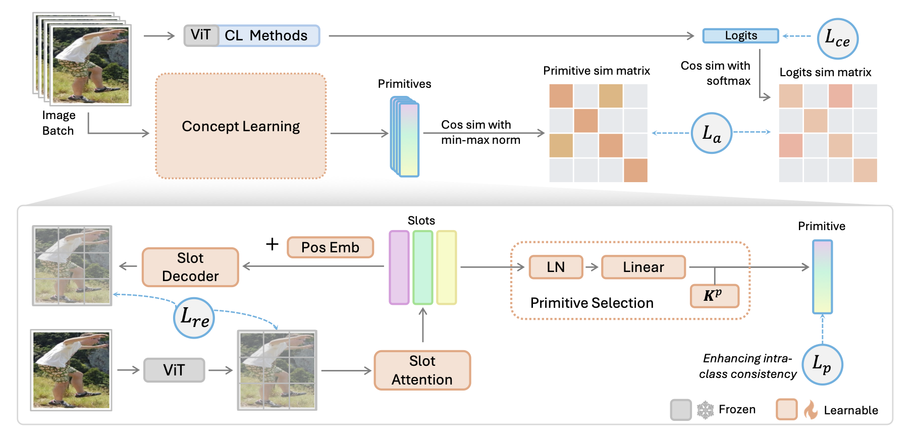

# CompSLOT

Official implementation for the ICLR 2026 Oral paper:
Plug-and-Play Compositionality for Boosting Continual Learning with Foundation Models.

Paper: https://openreview.net/forum?id=22hBwIf7OC

This project is built on top of [LAMDA-PILOT](https://github.com/LAMDA-CL/LAMDA-PILOT).

## Abstract

Vision learners often struggle with catastrophic forgetting due to their reliance on class recognition by comparison, rather than understanding classes as compositions of representative concepts. This limitation is prevalent even in state-of-the-art continual learners with foundation models and worsens when current tasks contain few classes. Inspired by the recent success of concept-level understanding in mitigating forgetting, we design a universal framework CompSLOT to guide concept learning across diverse continual learners. Leveraging the progress of object-centric learning in parsing semantically meaningful slots from images, we tackle the challenge of learning slot extraction from ImageNet-pretrained vision transformers by analyzing meaningful concept properties. We further introduce a primitive selection and aggregation mechanism to harness concept-level image understanding. Additionally, we propose a method-agnostic self-supervision approach to distill sample-wise concept-based similarity information into the classifier, reducing reliance on incorrect or partial concepts for classification. Experiments show CompSLOT significantly enhances various continual learners and provides a universal concept-level module for the community.



## Environment Setup

Requirements are managed in [pyproject.toml](pyproject.toml) and include PyTorch 2.0.1, torchvision 0.15.2, and timm 0.6.12.

```bash
uv sync
source .venv/bin/activate
```

## Data Preparation

1. Download CFST data from https://huggingface.co/datasets/jiangmingchen/CGQA_and_COBJ.
2. Unzip to `./data/CFST`.
3. Data structure should include:
	- `CFST/CGQA/CGQA_100/...`
	- `CFST/COBJ/annotations/...`
4. Keep the dataset structure consistent with the project data loader in `./utils/data_manager.py`.

## Quick Start

Training is driven by JSON configs and a single entry script `main.py`:

```bash
python main.py --config ./exps/aper_aperpter_cgqa.json
```

## Reproduce Main Pipeline

CompSLOT typically uses two stages:

1. Train slot learner.
2. Train target continual learner with slot-based regularization.

Example on CFST-CGQA:

```bash

python main.py --config ./exps/aper_aperpter_compslot_cgqa.json

# Or, you can learn slot learner and target cl algorithm separately.
# Stage 1: slot learner
python main.py --config ./exps/slot_cgqa.json

# Stage 2: target learner + CompSLOT regularization
python main.py --config ./exps/aper_aperpter_compslot_cgqa.json
```

For baselines without CompSLOT:

```bash
python main.py --config ./exps/aper_aperpter_cgqa.json
```

You can switch to CFST-COBJ by using the corresponding config files under [exps](exps).

## Key Config Notes

- Slot pretraining configs follow pattern: [exps/slot_cgqa.json](exps/slot_cgqa.json), [exps/slot_cobj.json](exps/slot_cobj.json).
- CompSLOT-enabled configs include fields such as:
- `use_slot`
- `slot_project`
- `slot_args`
- `slot_prefix`
- `use_s_l_reg`
- `s_l_reg_coeff`

During training, logs and args are saved to [logs](logs) with structure:

- dataset/init_cls/increment/project_name

## Repository Structure

- [main.py](main.py): global entry point.
- [trainer.py](trainer.py): training loop, task iteration, logging, and evaluation.
- [models](models): continual learner implementations.
- [models/slot_learner.py](models/slot_learner.py): slot learner and wrapper regularization logic.
- [backbone](backbone): backbone adapters and prompt modules.
- [utils](utils): data manager, model factory, and utilities.
- [exps](exps): ready-to-run experiment configurations.

## Implement Your Own Method

To add a new continual learner:

1. Implement a learner class in [models](models).
2. Ensure the learner provides `_get_loss(...)` for compatibility with the wrapper strategy in [models/slot_learner.py](models/slot_learner.py).
3. Register the learner in [utils/factory.py](utils/factory.py) via `get_model()`.
4. Add a new experiment JSON under [exps](exps).

## Citation

If you find this repository useful, please cite the paper:

```bibtex
@inproceedings{liao2026plugandplay,
title={Plug-and-Play Compositionality for Boosting Continual Learning with Foundation Models},
author={Weiduo Liao and Fei Han and Hisao Ishibuchi and Qingfu Zhang and Ying Wei},
booktitle={The Fourteenth International Conference on Learning Representations},
year={2026},
url={https://openreview.net/forum?id=22hBwIf7OC}
}
```

And the LAMDA-PILOT: 

```bibtex
@article{sun2025pilot,
    title={PILOT: A Pre-Trained Model-Based Continual Learning Toolbox},
    author={Sun, Hai-Long and Zhou, Da-Wei and Zhan, De-Chuan and Ye, Han-Jia},
    journal={SCIENCE CHINA Information Sciences},
    year={2025},
    volume = {68},
    number = {4},
    pages = {147101},
    doi = {https://doi.org/10.1007/s11432-024-4276-4}
}
```
